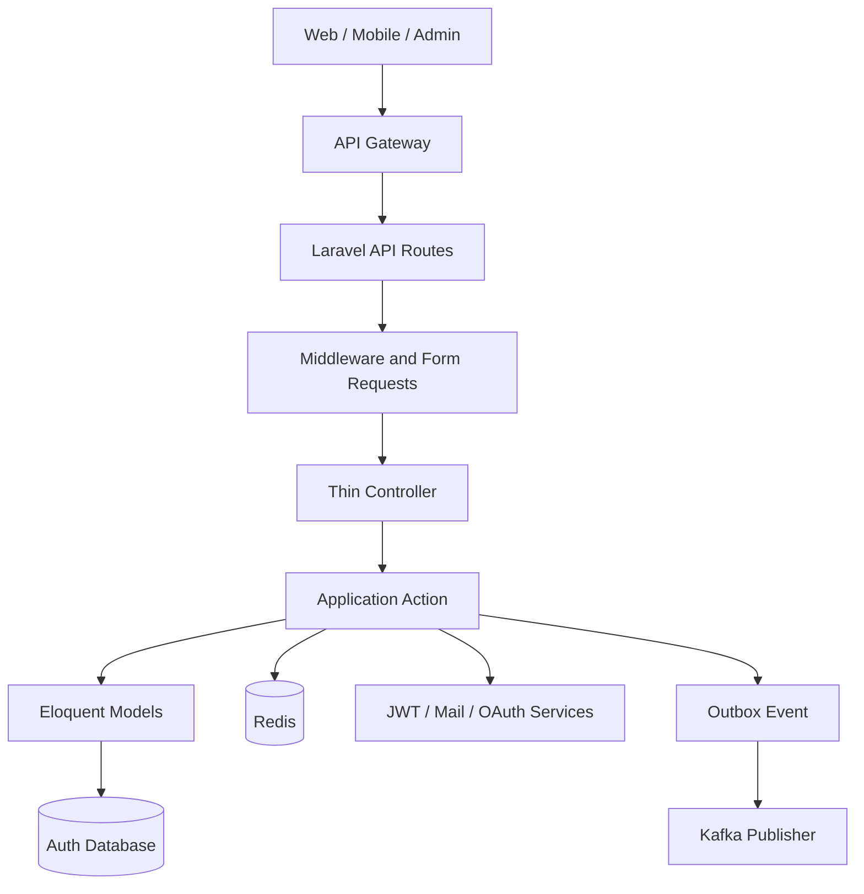

# Laravel Auth Service LLD

This is the canonical low-level design for the e-commerce Auth Service. The service uses a pragmatic Laravel architecture: retain clear HTTP and use-case boundaries, but use Eloquent and Laravel facilities directly until a real integration requires a dedicated abstraction.

## 1. Responsibilities and boundaries

The Auth Service owns:

- Registration and login
- Password management
- JWT access tokens
- Refresh-token rotation and revocation
- Logout from one or all devices
- Email verification
- Two-factor authentication
- Identity-level roles and permissions
- Account locking and login throttling
- Authentication audit logs
- Authentication events and their transactional outbox

It does not own customer profiles or addresses, product or order data, payments, or business-specific preferences. Those belong to their respective microservices.

## 2. Architecture



The normal request path is:

```text
Route -> Middleware/FormRequest -> Controller -> Action -> Eloquent/Service
```

Use these boundaries:

| Component | Responsibility |
| --- | --- |
| Route and middleware | Endpoint exposure, request IDs, throttling, authentication, and authorization |
| Form Request | Input normalization, authorization, and validation |
| Controller | Convert validated input to action input and format the response |
| Application Action | Coordinate one use case, transactions, models, and focused services |
| DTO | Carry typed action input/output when it improves clarity |
| Eloquent Model | Persist state and define database relationships/casts |
| Service | Encapsulate a substantial JWT, Redis, Kafka, mail, or OAuth integration |

Do not introduce a separate Domain entity or repository interface just to mirror an Eloquent model. Introduce an interface only when there are multiple real implementations, a meaningful external boundary, or clear testing value.

## 3. Project structure

Create files when their feature is implemented; do not add empty future scaffolds.

```text
app/
|-- Application/Auth/
|   |-- Actions/
|   |-- DTOs/
|   `-- Exceptions/
|-- Enums/
|-- Http/
|   |-- Controllers/Api/V1/Auth/
|   |-- Middleware/
|   |-- Requests/Auth/
|   `-- Resources/
|-- Models/
|-- Providers/
`-- Services/
    |-- Authentication/
    |-- Cache/
    |-- Messaging/
    `-- Notifications/
```

Current implementation status:

- Registration is implemented.
- Request ID assignment and API validation envelopes are implemented.
- User registration writes an outbox event atomically.
- Login, tokens, verification, password reset, 2FA, RBAC, Redis, Kafka publishing, and auditing remain planned until implemented and tested.

## 4. Registration

Endpoint:

```http
POST /api/v1/auth/register
```

Input:

```json
{
  "email": "user@example.com",
  "password": "StrongPass1",
  "password_confirmation": "StrongPass1"
}
```

Workflow:

1. Assign or validate the request ID.
2. Rate-limit the public endpoint.
3. Normalize the email and validate a unique email and confirmed password.
4. Execute `RegisterUserAction`.
5. Inside one database transaction, create a `pending` user with a hashed password and add `auth.user.registered.v1` to `outbox_events`.
6. Return HTTP 201 using the standard response envelope. Never return the password hash.

Customer name, address, phone, and other profile fields are intentionally excluded.

## 5. Persistence

### `users`

| Column | Type | Notes |
| --- | --- | --- |
| `id` | bigint | Internal primary key |
| `uuid` | ULID | Stable public identity, unique |
| `email` | varchar | Unique and normalized |
| `password_hash` | varchar | Hidden from API output |
| `status` | varchar | `pending`, `active`, `locked`, or `suspended` |
| `email_verified_at` | timestamp | Nullable |
| `two_factor_enabled` | boolean | Defaults to false |
| `two_factor_secret` | text | Nullable; encrypt when used |
| `locked_until` | timestamp | Nullable |
| `password_changed_at` | timestamp | Nullable |
| timestamps | timestamps | Created and updated times |

### `outbox_events`

| Column | Purpose |
| --- | --- |
| `id` | ULID event identifier |
| `event_type` | Versioned event name |
| `aggregate_id` | Public user identifier |
| `payload` | Event data |
| `metadata` | Correlation ID and source |
| `occurred_at` | Business-event timestamp |
| `published_at` | Null until successfully published |
| `attempts`, `last_error` | Publisher retry state |

Planned auth tables include `refresh_tokens`, `email_verification_tokens`, `two_factor_secrets`, `two_factor_recovery_codes`, `oauth_identities`, `authentication_audits`, and RBAC tables.

Refresh tokens must store a SHA-256 hash rather than the raw token, plus token/family IDs, expiry, revocation, replacement, device, IP, user agent, and last-used data.

## 6. API surface

| Method | Endpoint | Authentication | Purpose |
| --- | --- | ---: | --- |
| POST | `/api/v1/auth/register` | No | Register |
| POST | `/api/v1/auth/login` | No | Login |
| POST | `/api/v1/auth/refresh` | Refresh token | Rotate token pair |
| POST | `/api/v1/auth/logout` | Yes | Revoke current session |
| POST | `/api/v1/auth/logout-all` | Yes | Revoke all sessions |
| GET | `/api/v1/auth/me` | Yes | Authenticated identity |
| POST | `/api/v1/auth/verify-email` | Token | Verify email |
| POST | `/api/v1/auth/resend-verification` | Limited | Resend verification |
| POST | `/api/v1/auth/forgot-password` | No | Request password reset |
| POST | `/api/v1/auth/reset-password` | Reset token | Reset password |
| POST | `/api/v1/auth/change-password` | Yes | Change password |
| POST | `/api/v1/auth/2fa/setup` | Yes | Generate 2FA secret |
| POST | `/api/v1/auth/2fa/confirm` | Yes | Confirm 2FA setup |
| POST | `/api/v1/auth/2fa/challenge` | Challenge | Complete login |
| DELETE | `/api/v1/auth/2fa` | Yes | Disable 2FA |
| GET | `/api/v1/auth/sessions` | Yes | List active devices |
| DELETE | `/api/v1/auth/sessions/{id}` | Yes | Revoke a device |
| GET | `/api/v1/auth/.well-known/jwks.json` | No | Public signing keys |

Only registration is currently implemented. The rest of the table defines planned contracts, not available routes.

## 7. HTTP response contract

Success:

```json
{
  "success": true,
  "data": {},
  "meta": {
    "request_id": "01H..."
  }
}
```

Error:

```json
{
  "success": false,
  "error": {
    "code": "VALIDATION_FAILED",
    "message": "The supplied data is invalid.",
    "details": {}
  },
  "meta": {
    "request_id": "01H..."
  }
}
```

Never disclose whether an account exists during login or password-reset flows.

## 8. Authentication and token security

- Hash passwords with Laravel's configured Argon2id or bcrypt hasher.
- Sign access tokens asymmetrically with RS256 or ES256.
- Keep private keys only in Auth; distribute public keys through JWKS.
- Keep access tokens short-lived, normally 5-15 minutes.
- Validate `iss`, `aud`, `exp`, `nbf`, and `jti`.
- Do not place passwords, phone numbers, or sensitive profile data in claims.
- Store only hashed refresh tokens and rotate them on every use.
- If a rotated token is reused, revoke its complete token family.
- Require reauthentication for password, email, and 2FA changes.
- Encrypt 2FA secrets and hash recovery codes.
- Never log passwords, OTPs, access tokens, refresh tokens, or private keys.
- Use HTTPS and secure, `HttpOnly`, `SameSite` cookies when browser clients store refresh tokens.

## 9. Middleware and rate limiting

Public endpoints use request IDs, validation, and endpoint-specific throttles. Protected endpoints should use this order where relevant:

```text
Request ID
-> trusted proxy handling
-> rate limiting
-> JWT signature and claims validation
-> token revocation check
-> user-status check
-> email-verification check
-> permission check
-> controller
```

Suggested limits:

- Login: five failed attempts per minute per email/IP
- Password reset: three requests per hour
- Verification resend: three requests per hour
- 2FA challenge: five attempts per challenge
- Registration: ten requests per minute per client

## 10. Redis

Redis is for fast, temporary state; the database remains the durable source of refresh-token revocation.

```text
auth:login-attempt:{email}:{ip}
auth:token-blacklist:{jti}
auth:2fa-challenge:{challenge_id}
auth:email-verification-limit:{user_id}
auth:password-reset-limit:{email}
auth:permission-version:{user_id}
```

## 11. Kafka and transactional outbox

Version authentication events, for example:

```text
auth.user.registered.v1
auth.user.email_verified.v1
auth.user.logged_in.v1
auth.user.login_failed.v1
auth.user.password_changed.v1
auth.user.locked.v1
auth.user.deleted.v1
auth.role.changed.v1
```

State changes and their outbox event must be committed in the same database transaction. A background publisher reads unpublished rows, sends them to Kafka, and marks them published. Retry failures and require consumers to process duplicate deliveries idempotently.

## 12. Testing

Organize tests around implemented behavior:

```text
tests/
|-- Feature/Api/V1/Auth/
|   |-- RegisterTest.php
|   |-- LoginTest.php
|   `-- RefreshTokenTest.php
|-- Unit/Application/Auth/
`-- Integration/
    |-- Redis/
    `-- Messaging/
```

Critical scenarios include validation, duplicate identities, password hashing, locked or suspended users, refresh rotation and reuse, concurrent refreshes, logout scopes, invalid JWT claims, throttling, 2FA exhaustion, and outbox retry/idempotency.

Use feature tests for vertical HTTP behavior, unit tests for substantial action or service logic, and integration tests only when a real external adapter exists.

## 13. Development conventions

- Keep controllers thin and one action focused on one use case.
- Use Eloquent directly inside actions where it remains readable.
- Use `DB::transaction()` for multi-record state changes.
- Add DTOs, enums, policies, jobs, and services when they clarify real behavior.
- Do not create generic repositories, empty feature classes, or one-method wrappers around Laravel facilities.
- Run Pint on changed source paths and run focused plus full tests before handoff.
